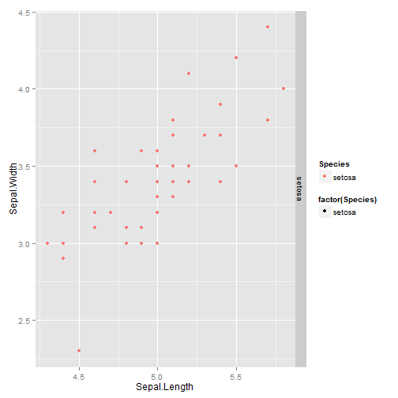

## Application Description

The application illustrates the discriminant analysis using any of the two variables as x-axis and y-axis and draws the linear regression line for modeling the relationship between one dependent variable and one explanatory variable. You may look at the relationship for all three species of iris by checking each type on the side panel. 

The application can be accessed at the following URL:
https://kwyi89.shinyapps.io/reactive-iris-plot/

--- 

## What data set does it use?

This application is using the famous iris flower data set. In order to understand the discriminant analysis, which is a method used in machine learning, pattern recognition, and statistics to find a linear combination of features that separates two or more classes of objects, this data set has been the most common data set for many classification techniques in machine learning. 


---

## Application Widgets

This shiny application includes 3 widgets:

1. checkboxGroupInput: A group of check boxes for picking the species
2. Actionbutton: a reactive action button to draw the linear regression line
3. RadioButtons: two sets of radio button for picking the dependent variable on x-axis and the explanatory variable on y-axis. 

Next slide shows a plot that uses setosa's Sepal.Length and Sepal.Width as variables. However, the application will draw any plots with user's inputs.

---

## An example of the application


```r
library(ggplot2)
data(iris)
    sp <- iris[iris$Species =="setosa",]    
    g <- ggplot(sp, aes(x= Sepal.Length, y= Sepal.Width)) +
        geom_point(data = sp, aes(shape = factor(Species), colour=Species)) +  
        facet_grid(Species ~ .)    
    print(g)
```

 
---

